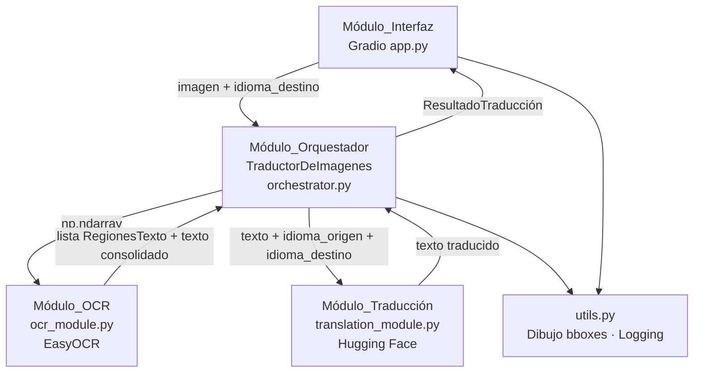

# Documento de Diseño Técnico
# Sistema de Traducción Multimodal de Imágenes

## Overview

El Sistema de Traducción Multimodal de Imágenes es una aplicación Python que implementa un pipeline de procesamiento de imágenes con texto. El usuario carga una imagen, el sistema detecta y extrae el texto mediante OCR, lo traduce al idioma destino elegido y presenta los resultados en una interfaz web.

### Objetivos de diseño

- **Modularidad**: cada componente es independiente y reemplazable sin afectar a los demás.
- **Open-source exclusivo**: EasyOCR, Hugging Face Transformers (Helsinki-NLP/opus-mt o facebook/mbart-large-50) y Gradio.
- **Portabilidad**: ejecutable en entorno local (Python 3.8+) y en Google Colab sin modificar el código fuente.
- **Aceleración GPU opcional**: detección automática mediante `torch.cuda.is_available()`.

### Tecnologías seleccionadas

| Componente | Tecnología | Justificación |
|---|---|---|
| OCR | [EasyOCR](https://github.com/JaidedAI/EasyOCR) | Soporte de +80 idiomas, API sencilla, basado en PyTorch |
| Traducción | [Helsinki-NLP/opus-mt](https://huggingface.co/Helsinki-NLP) + [facebook/mbart-large-50-many-to-many-mmt](https://huggingface.co/facebook/mbart-large-50-many-to-many-mmt) | Modelos locales, sin APIs de pago, amplia cobertura de pares de idiomas |
| Interfaz | [Gradio](https://www.gradio.app/) | Construcción rápida de UIs web para ML, compatible con Colab |
| Visualización | OpenCV / Pillow | Dibujo de bounding boxes sobre la imagen original |
| Detección de idioma | `langdetect` | Detección automática del idioma origen del texto extraído |

---

## Architecture

El sistema sigue una arquitectura de **pipeline secuencial** con un orquestador central que coordina módulos independientes. Cada módulo expone una interfaz bien definida y no conoce los detalles internos de los demás.



### Flujo de datos principal

```
Imagen (JPEG/PNG/BMP)
  → [Validación formato/tamaño]
  → [EasyOCR: detección de regiones + extracción de texto]
  → [Filtrado por confianza ≥ 0.3]
  → [Consolidación y ordenación de texto]
  → [Detección de idioma origen]
  → [Hugging Face: traducción al idioma destino]
  → [Dibujo de bounding boxes sobre imagen original]
  → [Presentación: imagen anotada + texto original + traducción]
```

---

## Components and Interfaces

### 1. Módulo_Interfaz (`app.py`)

Construido con `gradio.Blocks`. Responsabilidades:

- Validar formato MIME y tamaño de la imagen antes de invocar el orquestador.
- Presentar el selector de `Idioma_Destino` (disponible antes de cargar la imagen).
- Mostrar indicador de progreso durante el procesamiento.
- Renderizar: imagen anotada con bounding boxes, texto original con etiqueta e idioma detectado, texto traducido con etiqueta e idioma destino.
- Mostrar mensajes de error amigables (sin stack traces).

**Interfaz pública relevante:**

```python
def construir_interfaz() -> gr.Blocks:
    """Construye y retorna el objeto gr.Blocks con todos los componentes."""

def validar_imagen(archivo) -> tuple[bool, str]:
    """
    Valida formato MIME y tamaño del archivo.
    Returns: (es_valida, mensaje_error)
    """

def procesar_imagen(imagen: np.ndarray, idioma_destino: str) -> tuple:
    """
    Callback principal de Gradio. Invoca TraductorDeImagenes.procesar().
    Returns: (imagen_anotada, texto_original, idioma_origen, texto_traducido, mensaje_error)
    """
```

### 2. Módulo_Orquestador (`src/orchestrator.py`)

Clase `TraductorDeImagenes`. Coordina el pipeline y gestiona el estado de la sesión.

```python
class TraductorDeImagenes:
    ocr_reader: easyocr.Reader
    translation_models: dict          # {(src_lang, tgt_lang): pipeline}
    target_language: str
    confidence_threshold: float       # default: 0.3
    use_gpu: bool

    def __init__(self, target_language: str, use_gpu: bool = False) -> None
    def cargar_imagen(self, image_path: str) -> np.ndarray
    def detectar_texto(self, image: np.ndarray) -> list[dict]
    def traducir(self, text: str, source_lang: str) -> str
    def procesar(self, image_path: str) -> dict
```

**Contrato de `procesar()`:**
- Ejecuta en orden: `cargar_imagen` → `detectar_texto` → `traducir` → construcción del `ResultadoTraducción`.
- Si cualquier etapa lanza excepción, captura, registra en log (etapa + tipo + mensaje) y retorna `ResultadoTraducción` con campo `error` no vacío.
- Registra en log el tiempo de ejecución en ms de cada etapa.

### 3. Módulo_OCR (`src/ocr_module.py`)

Encapsula la interacción con EasyOCR.

```python
class ModuloOCR:
    def __init__(self, languages: list[str], use_gpu: bool = False,
                 confidence_threshold: float = 0.3) -> None

    def detectar_regiones(self, image: np.ndarray) -> list[RegionTexto]
    def consolidar_texto(self, regiones: list[RegionTexto]) -> str
```

**Comportamiento de `detectar_regiones()`:**
- Invoca `easyocr.Reader.readtext()` que retorna `[(bbox, text, confidence), ...]`.
- Filtra regiones con `confidence < confidence_threshold`.
- Retorna lista de `RegionTexto` (ver Data Models).
- Propaga excepciones con prefijo `"[OCR] "`.

**Comportamiento de `consolidar_texto()`:**
- Ordena regiones: primero por coordenada Y mínima, luego por X mínima dentro de la misma fila.
- Inserta `\n` entre regiones cuando la separación vertical supera el 50% de la altura media de la fila.
- Retorna cadena vacía si todas las regiones tienen texto vacío o solo espacios.

### 4. Módulo_Traducción (`src/translation_module.py`)

Encapsula la carga y uso de modelos Hugging Face.

```python
class ModuloTraduccion:
    _model_cache: dict   # {(src_lang, tgt_lang): pipeline}

    def __init__(self, use_gpu: bool = False) -> None

    def traducir(self, texto: str, idioma_origen: str,
                 idioma_destino: str) -> str

    def _cargar_modelo(self, idioma_origen: str,
                       idioma_destino: str) -> pipeline
    def _seleccionar_modelo(self, idioma_origen: str,
                            idioma_destino: str) -> str
```

**Estrategia de selección de modelo:**
1. Si el par está cubierto por un modelo `Helsinki-NLP/opus-mt-{src}-{tgt}` disponible en Hugging Face Hub, se usa ese modelo (más ligero, ~300 MB).
2. Si no existe modelo opus-mt directo, se usa `facebook/mbart-large-50-many-to-many-mmt` (~2.4 GB), que cubre 50 idiomas en cualquier dirección.
3. Si el idioma origen == idioma destino, retorna el texto sin modificar y sin cargar modelo.

**Caché de modelos:** los modelos se almacenan en `_model_cache` indexados por `(src_lang, tgt_lang)`. Las cargas subsiguientes del mismo par reutilizan el pipeline ya instanciado.

### 5. Utilidades (`src/utils.py`)

```python
def dibujar_bboxes(imagen: np.ndarray,
                   regiones: list[RegionTexto]) -> np.ndarray
    """Dibuja rectángulos delimitadores sobre la imagen. Retorna copia anotada."""

def detectar_idioma(texto: str) -> str
    """Detecta el idioma del texto usando langdetect. Retorna código ISO 639-1."""

def configurar_logging(nivel: str = "INFO") -> logging.Logger
    """Configura y retorna el logger del sistema."""

def milisegundos_actuales() -> int
    """Retorna el timestamp actual en milisegundos."""
```

---

## Data Models

### `RegionTexto`

Estructura de datos que representa una región de texto detectada por OCR.

```python
@dataclass
class RegionTexto:
    bbox: list[list[int]]   # [[x1,y1],[x2,y2],[x3,y3],[x4,y4]] — 4 puntos
    texto: str              # Texto reconocido
    confianza: float        # Valor en [0.0, 1.0]

    @property
    def y_min(self) -> int: ...
    @property
    def y_max(self) -> int: ...
    @property
    def x_min(self) -> int: ...
    @property
    def altura(self) -> int: ...
```

### `ResultadoTraduccion`

Estructura de datos retornada por `TraductorDeImagenes.procesar()`.

```python
@dataclass
class ResultadoTraduccion:
    texto_original: str          # Texto consolidado extraído de la imagen
    idioma_origen: str           # Código ISO 639-1 detectado (ej. "en", "ja")
    texto_traducido: str         # Texto traducido al idioma destino
    idioma_destino: str          # Código ISO 639-1 del idioma destino
    regiones: list[RegionTexto]  # Regiones detectadas (para dibujar bboxes)
    error: str                   # Vacío si no hay error; descripción del fallo si lo hay
    tiempos_ms: dict[str, int]   # {"ocr": 1200, "traduccion": 800, "construccion": 5}
```

### Mapeo de idiomas

```python
IDIOMAS_SOPORTADOS = {
    "Español":             {"easyocr": "es", "iso": "es", "mbart": "es_XX"},
    "Inglés":              {"easyocr": "en", "iso": "en", "mbart": "en_XX"},
    "Francés":             {"easyocr": "fr", "iso": "fr", "mbart": "fr_XX"},
    "Alemán":              {"easyocr": "de", "iso": "de", "mbart": "de_DE"},
    "Portugués":           {"easyocr": "pt", "iso": "pt", "mbart": "pt_XX"},
    "Italiano":            {"easyocr": "it", "iso": "it", "mbart": "it_IT"},
    "Chino simplificado":  {"easyocr": "ch_sim", "iso": "zh", "mbart": "zh_CN"},
    "Japonés":             {"easyocr": "ja",     "iso": "ja", "mbart": "ja_XX"},
    "Coreano":             {"easyocr": "ko",     "iso": "ko", "mbart": "ko_KR"},
}
```

---

## Correctness Properties

*Una propiedad es una característica o comportamiento que debe mantenerse verdadero en todas las ejecuciones válidas del sistema — esencialmente, una declaración formal sobre lo que el sistema debe hacer. Las propiedades sirven como puente entre las especificaciones legibles por humanos y las garantías de corrección verificables por máquina.*

### Property 1: Filtrado por umbral de confianza

*Para cualquier* lista de regiones de texto retornada por el Módulo_OCR, ninguna región en el resultado final debe tener un valor de `confianza` estrictamente inferior al umbral configurado (0.3 por defecto).

**Validates: Requirements 2.6**

---

### Property 2: Ordenación espacial del texto consolidado

*Para cualquier* conjunto de regiones de texto con coordenadas Y distintas, el texto consolidado debe aparecer en el mismo orden que las regiones ordenadas de arriba a abajo (Y mínima ascendente) y, dentro de la misma fila, de izquierda a derecha (X mínima ascendente).

**Validates: Requirements 3.1**

---

### Property 3: Identidad en traducción mismo idioma

*Para cualquier* texto de entrada no vacío, cuando el idioma origen es igual al idioma destino, el texto retornado por el Módulo_Traducción debe ser idéntico al texto de entrada, sin invocar ningún modelo de traducción.

**Validates: Requirements 4.3**

---

### Property 4: Caché de modelos reduce tiempo de traducción

*Para cualquier* par de idiomas (origen, destino) y cualquier texto de hasta 5.000 caracteres, la segunda invocación del Módulo_Traducción para ese mismo par debe completarse en ≤ 10 segundos, reutilizando el modelo ya cargado en caché.

**Validates: Requirements 4.5**

---

### Property 5: Rechazo de texto vacío o solo espacios en blanco

*Para cualquier* cadena compuesta únicamente de espacios en blanco (incluyendo la cadena vacía, tabulaciones y saltos de línea), el Módulo_Traducción debe lanzar una excepción con el mensaje "El texto de entrada para traducción está vacío" y no invocar ningún modelo.

**Validates: Requirements 4.6**

---

### Property 6: Resultado de traducción contiene texto original

*Para cualquier* imagen de entrada que contenga al menos una región de texto con confianza ≥ 0.3, el `ResultadoTraduccion` producido por el orquestador debe contener en `texto_original` exactamente el texto consolidado retornado por el Módulo_OCR.

**Validates: Requirements 3.4**

---

### Property 7: Propagación de errores con identificación de etapa

*Para cualquier* excepción lanzada por el Módulo_OCR o el Módulo_Traducción durante el procesamiento, el `ResultadoTraduccion` retornado por el orquestador debe tener el campo `error` no vacío y debe identificar la etapa donde ocurrió el fallo.

**Validates: Requirements 2.7, 6.3**

---

### Property 8: Bounding boxes cubren regiones detectadas

*Para cualquier* imagen anotada producida por `dibujar_bboxes`, el número de rectángulos dibujados debe ser igual al número de regiones en la lista de entrada.

**Validates: Requirements 5.4, 11.3**

---

## Error Handling

### Estrategia general

El sistema usa una estrategia de **propagación controlada**: los módulos internos lanzan excepciones tipadas, el orquestador las captura todas, las registra en log y las convierte en un `ResultadoTraduccion` con campo `error` poblado. La interfaz nunca expone stack traces al usuario.

### Tabla de errores por módulo

| Módulo | Condición | Acción |
|---|---|---|
| Módulo_Interfaz | Formato MIME no soportado | Mensaje: "Formato no soportado. Por favor, sube una imagen en formato JPEG, PNG o BMP." |
| Módulo_Interfaz | Tamaño > 10 MB | Mensaje: "La imagen supera el límite de 10 MB. Por favor, sube una imagen más pequeña." |
| Módulo_Interfaz | Sin idioma destino seleccionado | Mensaje indicando que debe seleccionar idioma destino |
| Módulo_OCR | Sin regiones detectadas | Retorna lista vacía; orquestador pone `error = "No se detectó texto en la imagen"` |
| Módulo_OCR | Excepción interna | Propaga con prefijo `"[OCR] "` |
| Módulo_Traducción | Par de idiomas no soportado | Excepción: `"Par de idiomas no soportado: {src} → {tgt}"` |
| Módulo_Traducción | Texto vacío | Excepción: `"El texto de entrada para traducción está vacío"` |
| Módulo_Traducción | Texto > 50.000 caracteres | Excepción: `"El texto supera el límite de 50.000 caracteres permitido para traducción"` |
| Módulo_Orquestador | Método invocado antes de `cargar_imagen` | `ResultadoTraduccion.error = "Imagen no cargada. Invoque cargar_imagen antes de continuar."` |
| Módulo_Orquestador | Cualquier excepción de módulo | Captura, log (etapa + tipo + mensaje), retorna `ResultadoTraduccion` con `error` |

### Logging

Todos los eventos de error y los tiempos de ejecución se registran mediante el módulo estándar `logging` de Python. Formato de entrada de log:

```
[TIMESTAMP] [NIVEL] [ETAPA] mensaje
Ejemplo: [2024-01-15 10:23:45] [ERROR] [OCR] EasyOCRException: CUDA out of memory
Ejemplo: [2024-01-15 10:23:46] [INFO] [TIMING] ocr=1234ms traduccion=890ms construccion=3ms
```

---

## Testing Strategy

### Enfoque dual

El sistema combina **pruebas unitarias basadas en ejemplos** para casos concretos y condiciones de error, con **pruebas basadas en propiedades** (property-based testing) para verificar invariantes universales sobre el comportamiento de los módulos.

### Pruebas unitarias (pytest)

Ubicadas en `tests/`. Cubren:

- `test_ocr_module.py`: detección con imágenes de prueba reales, filtrado por confianza, consolidación de texto, manejo de imagen sin texto.
- `test_translation_module.py`: traducción de pares soportados, identidad mismo idioma, rechazo de texto vacío, rechazo de texto > 50.000 chars, excepción par no soportado, caché de modelos.
- `test_orchestrator.py`: flujo completo exitoso, manejo de errores de OCR, manejo de errores de traducción, invocación fuera de orden, registro de tiempos.

### Pruebas basadas en propiedades (Hypothesis)

Se usa la biblioteca [Hypothesis](https://hypothesis.readthedocs.io/) para Python. Cada prueba de propiedad ejecuta un mínimo de **100 iteraciones** con entradas generadas aleatoriamente.

**Configuración base:**

```python
from hypothesis import given, settings
from hypothesis import strategies as st

@settings(max_examples=100)
@given(...)
def test_propiedad_N(...):
    # Feature: multimodal-image-translation, Property N: <texto de la propiedad>
    ...
```

#### Pruebas de propiedad planificadas

| Propiedad | Archivo | Descripción del generador |
|---|---|---|
| P1: Filtrado por confianza | `test_ocr_module.py` | Genera listas de `RegionTexto` con confianzas aleatorias en [0.0, 1.0] |
| P2: Ordenación espacial | `test_ocr_module.py` | Genera listas de regiones con coordenadas bbox aleatorias |
| P3: Identidad mismo idioma | `test_translation_module.py` | Genera textos no vacíos y selecciona un idioma al azar para origen y destino iguales |
| P4: Caché reduce tiempo | `test_translation_module.py` | Genera textos de hasta 5.000 chars, mide tiempo de segunda invocación |
| P5: Rechazo texto vacío/blancos | `test_translation_module.py` | Genera cadenas de solo espacios en blanco (`st.text(alphabet=" \t\n\r")`) |
| P6: Texto original en resultado | `test_orchestrator.py` | Genera imágenes sintéticas con texto conocido, verifica campo `texto_original` |
| P7: Propagación de errores | `test_orchestrator.py` | Inyecta excepciones en mocks de OCR y traducción, verifica campo `error` |
| P8: Bounding boxes = regiones | `test_ocr_module.py` | Genera listas de regiones, verifica que `dibujar_bboxes` produce N rectángulos |

### Criterio de cobertura

El sistema debe superar el **80% de los casos de prueba** definidos en `tests/` al ejecutar `pytest tests/` (Requisito 11.7).

### Pruebas de integración

- Procesamiento end-to-end con imagen real en inglés → traducción al español (< 60 s sin GPU).
- Procesamiento end-to-end con imagen en japonés/chino → traducción al español (< 120 s sin GPU).
- Arranque de la interfaz Gradio sin excepciones no controladas.
